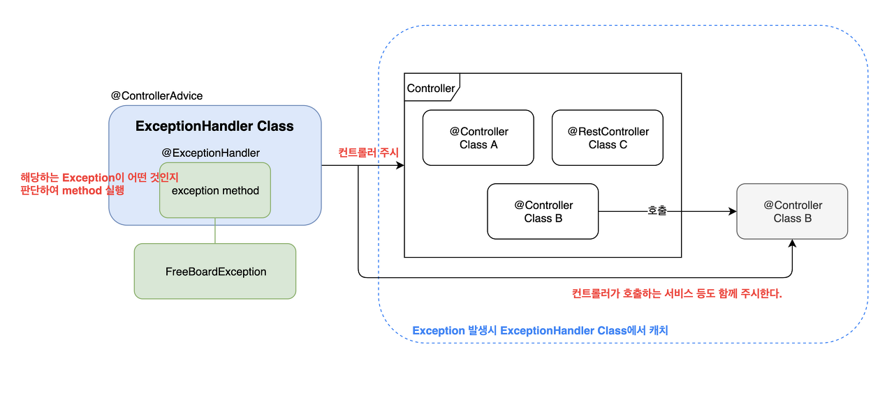

2. Final
- final 검증은 누가 하냐 
```text
컴파일러가 해준다. 컴파일러는 final에 대한 값 할당을 엄격하게 검사한다.
만약 final키워드가 붙은 변수가 존재하는 클래스는 생성자에서 final변수가 초기화
되는지 검사한다.
또한 만약 final키워드 변수를 가진 클래스를 상속 받았다면
부모 클래스의 final변수가 초기화 되었는지 검사한다.
```
6. Exception
- spring에서는 예외 처리를 어떻게 할 수 있는가

spring에서는 대표적으로 @ControllerAdvice와 @ExceptionHandler 가 있다.
- @ControllerAdvice는 특정 컨트롤러에 국한 되지 않고 애플리케이션 전체에서 발생하는 예외를
중앙에서 관리하고 일관된 방식으로 처리 할 수 있도록 해준다.

- @ExceptionHandler는 특정 컨트롤러 내에서 예외처리를 해준다.
즉, 해당 컨트롤러에 국한된 예외처리 로직을 정의 할 수 있다.
```java
@ExceptionHandler(CustomException.class)
public String handleCustomException(CustomException ex) {
    // ...
}
```
또한 @ControllerAdvice를 사용할때 내부에 @EXceptionHandler를 사용하여 구현하게 된다.

@ControllerAdvice의 동작 방식이 잘 그려진 그림을 발견했는데 


하지만 '기본적으로' Spring Security 필터와 Interceptor에서 발생하는 Exception은 @ControllerAdvice에서처리되지 
않을 수 있다. Spring Security의 예외 처리 메커니즘을 따
게 된다. 

(하지만 다른 방법을 사용해 @ControllerAdvice에서 잡게 할 수는 있다... 아래글을 참고)
[spring security 전역으로 처리하기](https://colabear754.tistory.com/172#%EC%8B%9C%ED%81%90%EB%A6%AC%ED%8B%B0%EC%97%90%EC%84%9C_%EB%B0%9C%EC%83%9D%ED%95%9C_%EC%98%88%EC%99%B8_%EA%B7%B8%EB%8C%80%EB%A1%9C_%EC%B2%98%EB%A6%AC%ED%95%98%EA%B3%A0_%EC%8B%B6%EC%96%B4!)
