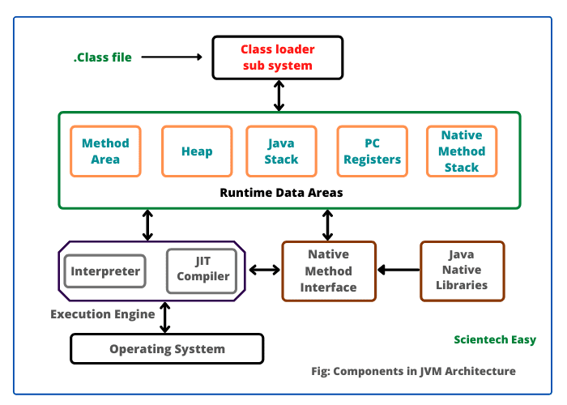

# JVM을 실행시키면 Class Loader에는 어떤 일이 일어나는가?

### JVM 의 동작 방식



JVM에서 자바 컴파일러가 컴파일한 .class 파일을의 묶음을 실행시키면

1. `Class Loader`가 동적 로딩을 통해 필요한 클래스들을 로딩 및 링킹 하여 `Runtime Data Area`에 올린다.
2. `Runtime Data Area` 에 로딩된 바이트 코드는 `Execution Engine`을 통해 해석된다.
3. 이 과정에서 `Execution Engine` 에 의해 **GC의 작동**과 **Thread 동기화**가 이루어진다.

# Class Loader 의 링킹 방식과 종류 및 역할을 알고있는가?


***Class Loader가 동적 로딩을 통해 필요한 클래스들을 로딩 및 링킹 하여 Runtime Data Area(데이터 저장 영역)에 올린다.***

그렇다면 어떻게 `.class` 파일들을 동적으로 로딩하고 링킹한다는 것일까?

이는 3단계로 나뉜다.

1. Loading : 클래스 파일을 가져와서 **동적으로** JVM의 **메모리(Runtime Area)에 로드**한다.
2. Linking : 클래스 파일을 사용하기 위해 **검증**하는 과정
3. Initialization : 클래스 변수들을 **적절한 값으로 초기화**한다.

클래스의 동적 로딩은 다음과 같은 세 가지 주요 알고리즘으로 구분된다:

### 동적 로직 알고리즘

- 로드 타임 동적 로딩 (Load-time Dynamic Loading): JVM 시작 시 필수 클래스들을 로드
    
    JVM 이 시작되고 .class 파일을 로드할때 모든 클래스의 최상위 클래스인 Object와 java.lang, java.util 등 일부 자바 API 를 함께 로드한다. (`JNI`)
    
    ```java
    JNI(Java Native Interface)는 자바 프로그램이 다른 언어(주로 C, C++)로 작성된 네이티브 코드와 상호 작용할 수 있게 해주는 프로그래밍 프레임워크입니다. JNI를 통해 JVM은 운영 체제나 하드웨어에 특화된 기능을 사용할 수 있으며, 이는 자바의 "Write Once, Run Anywhere" 철학을 유지하면서도 플랫폼 특정 기능을 활용할 수 있게 해줍니다.
    ```
    
- 런타임 동적 로딩 (Run-time Dynamic Loading): 실행 중 필요한 시점에 클래스를 로드
    
    클래스의 Method 등이 동작할때 필요해지는 클래스들이 있다. 인스턴스의 메소드에서 다른 클래슬가 필요해지는 시점에 로드되는 방식이 런타임 동적 로딩이다.
    
- 지연 로딩 (Lazy Loading): 클래스 사용 시점까지 로딩을 지연시켜 메모리 효율을 높임
    
    지연로딩은 해당 클래스 파일을 로드할때 메서드 등에서 객체 인스턴스를 만들 때 사용하는 클래스들을 로드할때 사용된다. 해당 클래스가 호출되어 인스턴스를 만드는 시점에 지연로딩 방식을 사용한다.
    

### Class Loader 의 종류와 역할

Loading 단계에서 로드하려는 컴파일 클래스들을 메모리에 적재할 때, 클래스의 종류와 용도에 따라 다른 Class Loader가 사용된다. 주요 Class Loader의 종류와 역할은 다음과 같다:

- **Bootstrap Class Loader:**
    - Java의 핵심 클래스를 로드
    - 네이티브 코드로 구현됨
    - Java 9 이전: rt.jar에서 클래스 로드
    - Java 9 이후: /lib 내 모듈화된 클래스 로드
- **Platform Class Loader (구 Extension Class Loader):**
    - Java 확장 클래스를 로드
    - Java 9 이전: jre/lib/ext 디렉토리에서 클래스 로드
    - Java 9 이후: 이름 변경 및 역할 조정
- **Application Class Loader (System Class Loader):**
    - 애플리케이션 클래스패스에 지정된 클래스를 로드
    - 주로 개발자가 작성한 클래스를 로드
- **User-Defined Class Loader:**
    - 사용자가 직접 정의하고 구현한 클래스 로더
    - 특수한 로딩 요구사항을 처리하기 위해 사용


이러한 Class Loader들은 계층 구조를 이루며, 각자의 역할에 따라 효율적으로 클래스를 로드하고 관리한다.

### Class Loader의 4가지 원칙

1. **가시성 원칙 (Visibility Principle)**
    
    자식 Class Loader는 부모 Class Loader가 로드한 클래스를 볼 수 있지만 반대로 부모는 자식이 로드한 클래스를 볼 수 없다.
    
2. **유일성 원칙(Uniqueness Principle)**
    
    부모가 로드한 클래스를 자식이 다시 로드하지 않아야 한다. 
    
    → 클래스가 단 한번만 로드되어야 한다.
    
3. **위임 계층 원칙(Delegation Hierarchy Principle)**
    
    JVM은 클래스 로딩 요청을 받을 클래스로더를 선택하기 위해 위임계층을 따른다.
    
    
    
    가장 아래의 애플리케이션 클래스 로더가 자기가 받은 클래스 요청을 부모인 확장 클래슬 로더에 위암한 후 다시 부모인 부트스트랩 클래스 로더에 이를 위임한다. 마지막 애플리케이션 클래스 로더가 찾지 못하면 ClassNotFoundException 예외가 발생한다.
    
4. **언로딩 금지 원칙(No Unloading Principle)**
    
    클래스 로더는 클래스를 로드할 수는 있지만 이미 로드한 클래스를 언로드할수는 없습니다.
    
    언로드 대신에 현재 클래스 로더를 제거하고 새로운 클래스 로더를 만들 수 있습니다.
    

# RuntimeData Area

T메모리 구조를 가진다.


- Static 영역 - `Method Area`
- stack 영역 - `JVM Stack`
- heap 영역 - `Heap`


1. JRE이 자바 프로그램을 실행시킬 때에 main을 찾는다.
2. 있으면 Class Loader 가 목적파일(.class)을 실행시킴.
3. stack 영역에 main()의 Stack Frame 이 위치하고 변수 영역에 인자를 위치시킨다.
    1. 지역변수의 경우 초기화될때 위치된다.
    2. 클래스 선언 {} 을 제외하고 메소드의 {}, if 의 {}가 생길때마다 Stack Frame 이 생긴다.
4. 메소드를 실행
5. } 괄호를 만나면 Stack Frame이 사라진다.
6. JRE는 JVM 종료시키고 위치했던 메모리들이 모두 없어진다.


### 멀티스레드


멀티스레드는 stack영역(JVM stack)을 스레드 개수만큼 분할한다.

- Spring Framework 는 클라이언트의 요청만큼 스레드를 만든다.

### 참고.

- https://medium.com/@gsy4568/jvm%EC%9D%98-%EC%B2%AB%EA%B4%80%EB%AC%B8-classloader-ecdf93d53a7b
- https://blog.hexabrain.net/397


# 핫스팟 VM 의 역할과 GraalVM의 등장
###  Java 1.3 때 Hotspot VM이 추가되었고 해당 VM에는 2개의 JIT 컴파일러가 포함되어있음. c1, c2

  - c1
        - 클라이언트 컴파일러(Client Compiler)
        - 코드 최적화는 덜하지만 즉시 시작되는 속도는 빠름
        - 즉시 실행되는 데스크톱 애플리케이션 등에 적합함
  - c2
        - 서버 컴파일러(Server Compiler)
        - 즉시 시작되는 속도는 느리지만 최적화는 많이 되어 warm-up 후에는 빠름
        - 장기 실행되는 서버 애플리케이션 등에 적합함
- HotSpot VM의 JIT 컴파일러는 성능이 뛰어나지만 유지보수가 어려워지면서 한계에 직면했다.
    - C++ 개발자를 구하기 어려움
    - 오래된 만큼 상당히 복잡함
    - 최근에 중요한 최적화가 거의 없었음
- GraalVM은 Java로 작성된 새로운 JIT 컴파일러인 Graal 컴파일러를 HotSpot VM에 추가하여 고성능, 다양한 언어 지원, 빠른 시작 속도 등의 장점을 제공한다.
- GraalVM은 OpenJDK를 기반으로 하며, 네이티브 이미지 기술을 통해 JVM 없이 실행 가능한 독립형 실행 파일을 생성할 수 있다.

참고 
- https://mangkyu.tistory.com/301