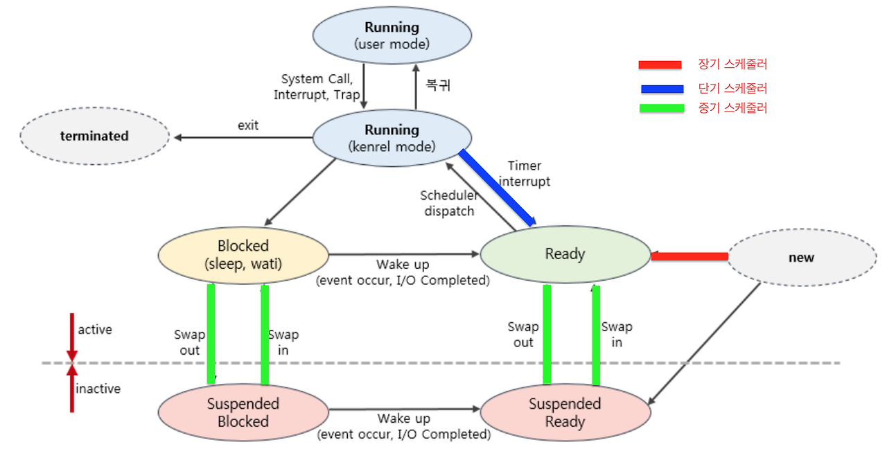

**5. 단기, 중기, 장기 스케쥴러에 대해 설명해 주세요.**

`장기 스케줄러`는 작업 스케줄러라고도 불리며 어떤 프로세스를 준비 큐에 넣을지 결정하는 역할. 즉 ,디스크에서 하나의 프로그램을 가져와 커널에 등록하면 프로세스가 되는데 이때 디스크에서 어떤 프로그램을 가져와 커널에 등록할지(준비큐에 등록할지) 결정합니다.

또한 장기 스케줄러는 메모리에 동시에 올라가 있는 프로세스의 수를 조절하는 역할을 합니다.

`중기 스케줄러`는 메모리에 적재된 프로세스 수를 관리하는 스케줄러. 너무 많은 프로스스에게 메모리를 할당해 시스템의 성능이 저하되는 경우 이를 해결하기 위해 메모리에 적재된 프로세스의 수를 동적으로 조절하기 위해 추가된 스케줄러 

`단기 스케룰러,  CPU 스케줄러`라고도 불리며 준비 상태의 프로세스 중에서 어던 프로세스를 다음 번에 실행 상태로 만들 것인지를 결정합니다. 

일반적으로 스케줄러라고 하면 단기 스케줄러를 말한다.

- 현대 OS에는 단기, 중기, 장기 스케쥴러를 모두 사용하고 있나요?
    - 현대의 시분할 시스템에서 사용되는 운영 체제에는 일반적으로 장기 스케줄러를 두지 않는 경우가 대부분입니다. 과거에는 적은 양의 메모리를 많은 프로세스들에게 할당하면 프로세스당 메모리 보유량이 적어져 장기 스케줄러가 이를 조절하는 역할을 했지만 현대의 운영체제 에서는 프로세스가 시작되면 장기 스케줄러 없이 바로 그 프로세스에 메모리를 할당해 준비 큐에 넣어주게 됩니다.
    - 결국 운영체제가 프로세스 메모리를 할당하는게 장기프로세스가 동작 하는게 아닌가?
        
        ### 장기 스케줄러의 전통적인 역할
        
        장기 스케줄러는 **디스크에 저장된 작업(job)을 메모리에 적재하여 준비 큐에 추가**하는 역할을 했습니다. 과거의 컴퓨터 환경에서는 메모리 자원이 매우 제한적이었기 때문에, 어떤 작업이 메모리에 올라갈지를 결정하는 것이 중요했죠. 이를 통해 메모리 부족으로 인해 시스템 성능이 저하되는 상황을 방지했습니다.
        
        ### 현대 운영체제에서의 변화
        
        1. **충분한 메모리 자원**: 현대 컴퓨터는 메모리 자원이 과거보다 풍부하며, 여러 프로세스가 동시에 메모리에 적재될 수 있습니다. 따라서 디스크에 대기 중인 작업을 선별적으로 메모리에 올릴 필요성이 줄어들었습니다.
        2. **다단계 스케줄링의 간소화**: 현대 시스템에서는 작업이 요청되면 바로 메모리에 적재하고 준비 큐에 넣습니다. 이는 운영 체제에서 프로세스를 초기화하는 과정에 포함되어 있으며, 별도의 장기 스케줄러가 필요하지 않습니다.
        3. **가상 메모리의 도입**: 가상 메모리 덕분에 물리적 메모리가 부족하더라도 프로세스 실행이 가능합니다. 디스크 스왑 영역을 활용해 프로세스의 메모리 요구를 충족시킬 수 있으므로 장기 스케줄러의 역할이 약화되었습니다.
        
        ### 질문에 대한 답변
        
        맞습니다. 현대 운영 체제에서 **프로세스 생성 시 메모리를 할당하고 준비 큐에 넣는 작업이 사실상 장기 스케줄러의 역할을 대신**하고 있다고 볼 수 있습니다. 다만, 이 과정은 장기 스케줄러라는 별도의 모듈이 아닌, 운영 체제의 프로세스 생성 및 관리 메커니즘의 일부로 통합되어 있습니다.
        
        결론적으로, 현대 시스템에서는 장기 스케줄러라는 독립적인 구성 요소가 없는 경우가 대부분이지만, 그 기능은 여전히 다른 방식으로 구현되어 있다고 이해하면 됩니다.
        
    - https://kosaf04pyh.tistory.com/191
- 프로세스의 스케쥴링 상태에 대해 설명해 주세요.
    
    
    
    - `new` : 프로세스 생성 중, 
    커널 공간에 PCB 가 만들어진 상태
    - `ready` : 프로세스가 cpu를 기다리는 상태, 
    프로세스가 메모리에 적재된 상태로 필요한 자원을 모두 얻은 상태
    - `runnging` : 프로세스가 cpu를 할당 받아 명령어를 수행중인 상태, 
    CPU가 하나인 경우, 여러 프로세스가 동시에 실행되도 실제로 실행중인 프로세스는 매 시점 하나 뿐이다.
    - `blocked`: 프로세스가 CPU를 할당받아도 당장 실행할 수 없는 상태
    현재 프로세스가 I/O작업 등을 처리 중인 상태로, running 상태에서 디스크 I/O작업을 수행할 때는 CPU를 점유하고 있어도 다음 명령어를 수행하지 못하기 때문에 CPU를 낭비하지 않기 위해 I/O 작업을 하는 프로세스는 CPU를 반납하고 `Device Queue`에 들어가게 된다.
    `Device Queue` : **특정 I/O 디바이스(장치)에 대한 작업 요청들을 저장해 두는 대기열**을 의미
    - `terminated`: 종료시스템 콜을 받고 **PCB가 할당 해제되기 직전의 상태**
    프로세스의 실행이 완료되고 할당된 CPU를 반납한 상태. 커널 공간내의 PCB는 남아있다. 완전히 종료되면 더 이상 프로세스가 아니다.
    - `suspended`: 프로세스의 중지 상태로, 메모리를 강제로 뺏긴 상태로 특정한 이유로 프로세스의 수행이 정지된 상태. 
    외부에서 다시 재개시키지 않는 이상 다시 활성화 될 수 없다. (blocked는 잠시 중지되어있다 끝나면 다시 ready 상태로 돌아온다.)
    - preemptive/non-preemptive 에서 존재할 수 없는 상태가 있을까요?
        - **`Asleep(Block)`** 상태는 작업 실행이 불가능한 상태로, 자원 할당을 대기 하는 등 사전 정의 된 다른 작업이 완료될 때까지 작업 수행이 중지되는 상태입니다. 따라서 Asleep(Block) 상태는 preemptive 및 non-preemptive 스케줄링 모두에서 존재할 수 없습니다.
    - Memory가 부족할 경우, Process는 어떠한 상태로 변화할까요?
        - Active(Swapped-in) 상태에서의 Process는 더 이상 작업을 수행할 수 없게 되기 때문에 Swap-out 되어 Suspended(Swapped-out) 상태로 전이됩니다.
        - 이 때 메모리 부족으로 필요한 데이터를 가져올 수 없는 경우 Block가 되어 다른 프로세스가 끝나기를 기다리거나, OS가 프로세스를 강제로 종료시켜 Terminated 상태로 전이됩니다.