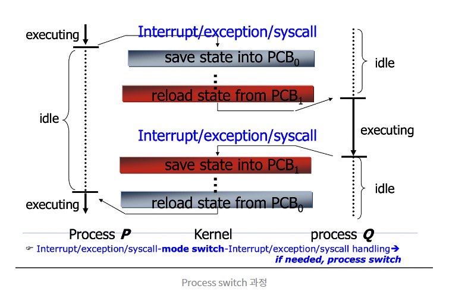

**6. 컨텍스트 스위칭 시에는 어떤 일들이 일어나나요?**

컨텍스트란 컨텍스트란 프로세스/스레드의 **상태**

컨텍스트 스위칭이 발생하면 운영 체제는 현재 실행 중인 프로세스의 상태(레지스터 값, 프로그램 카운터 등)를 저장합니다. 그리고 다음 실행될 프로세스의 컨텍스트를 가져와 PCB에 업데이트하고 실행을 전환합니다.

컨텍스트 스위칭이 발생하면?

1. 우선 **컨텍스트 저장.**
    
    현재 프로세스의 상태를 저장합니다.
    
    이는 CPU 레지스터 값, 프로그램 카운터, 스택 포인터 등 프로세스의 실행 상태를 나타내는 관련 데이터 값을 의미합니다.
    
2. **컨텍스트 불러오기**
    
    운영 체제는 실행될 다음 프로세스의 저장된 컨텍스트를 가져옵니다.
    
3. **프로세스 제어 블록(PCB) 업데이트**
    
    프로세스와 관련된 데이터 구조인 프로세스 제어 블록(PCB)을 프로세스 상태와 실행 기록의 변경 사항을 반영하도록 업데이트 합니다.
    
4. **실행 전환**
    
    CPU는 새로운 프로세스의 컨텍스트로 실행을 전환합니다.
    

컨텍스트 스위칭은 운영 체제가 여러 프로세스를 동시에 실행하는 것처럼 보이게 하는 역할을 합니다.

이를 통해 프로세스는 서로 간섭하지 않으면서 CPU 시간을 공유할 수 있습니다. 그러나 컨텍스트 스위칭은 프로세스의 실행 컨텍스트를 저장하고 복원하는 데 필요한 시간과 리소스로 인해 비용이 발생합니다.

단점 / 장점

1. **오버헤드:** 컨텍스트 스위칭은 프로세스 컨텍스트를 저장하고 복원하는 데 오버헤드를 발생시킵니다. 이러한 오버헤드는 컨텍스트 스위칭이 빈번하게 발생하는 경우 시스템 성능에 영향을 미칠 수 있습니다.
2. **응답성:** 컨텍스트 스위칭은 운영 체제가 빠르게 이벤트에 응답하고 동시 실행을 제공하는 것처럼 보이도록 해주며 시스템의 응답성을 향상시킵니다.
- 프로세스와 스레드는 컨텍스트 스위칭이 발생했을 때 어떤 차이가 있을까요?
    - 우선 프로세스 컨택스트 스위치와 스레드 컨텍스트 스위치가 일어나는 차이는 다음과 같고
        - 프로세스1의 스레드1 → 프로세스2의 스레드2 = **`Process Context Switching`**
        - 프로세스1의 스레드1 → 프로세스1의 스레드2 = **`Thread Context Switching`**
    
    쓰레드 컨텍스트 스위치는 **커널 모드 전환** + **CPU register 상태 교체와 같은 기본 작업만 하면 되기에 빠르다**
    
    하지만 프로세스 컨텍스트 스위치는   **`가상 메모리 주소 관련 처리`**를 추가로 수행해야 한다. 
    
    1. [MMU(Memory Management Unit)](https://ko.wikipedia.org/wiki/%EB%A9%94%EB%AA%A8%EB%A6%AC_%EA%B4%80%EB%A6%AC_%EC%9E%A5%EC%B9%98)이 새로운 프로세스의 주소 체계를 바라보도록 수정
    2. 캐시 역할을 하는 [TLB(Translation Lookaside Buffer)](https://ko.wikipedia.org/wiki/%EB%B3%80%ED%99%98_%EC%83%89%EC%9D%B8_%EB%B2%84%ED%8D%BC)를 완전히 비워줘야 함.
    
    https://engineerinsight.tistory.com/284
    
- 컨텍스트 스위칭이 발생할 때, 기존의 프로세스 정보는 커널스택에 어떠한 형식으로 저장되나요?
    - 프로세스는 user stack과 kernel stack을 가지고 있다.이들을 분리하는 이유는 mode분리와 마찬가지로 system을 보호하기 위함이다.
    https://blog.naver.com/lache96/140051813931
    
    
    
    - 좌측 위부터, 프로세스p가 실행한다.
    - 프로세스p에서 context switch를 유발하는 interrupt or exception or systemcall이 발생하였다.
    - pcb0에 p의 state를 저장한다. (커널에서 발생함)
    - pcb1에 프로세스q를 reload (커널에서 발생함)
    - 프로세스q를 실행한다.
    - **이때, context switch는 mode switch를 필연적으로 발생시키지만, mode switch는 context switch를 필연적으로 발생시키지 않는다.**
- 컨텍스트 스위칭은 언제 일어날까요?
    - 우선 가장 먼저 생각해 볼 수 있는 의도적인 스위칭은,
        1. I/O **인터럽트 와 같이** 하드웨어 인터럽트가 발생하는 경우입니다.
        2. **사용자 영역에서의 시스템 콜**
            
            이 경우 CPU는 사용자 모드에서 커널 모드로 전환됩니다.
            
        
        그리고 스케줄링 방식 변화에 따라 사용자 의도와 관계없이 일어나는 스위칭은,
        
        1. 더 높은 우선순위의 프로세스나 스레드가 실행 가능한 상태가 되어서 CPU 스케줄러가 현재 실행 중인 프로세스나 스레드를 중단하고 높은 우선순위 엔티티에 CPU를 할당하는 경우가 있을 수 있습니다.